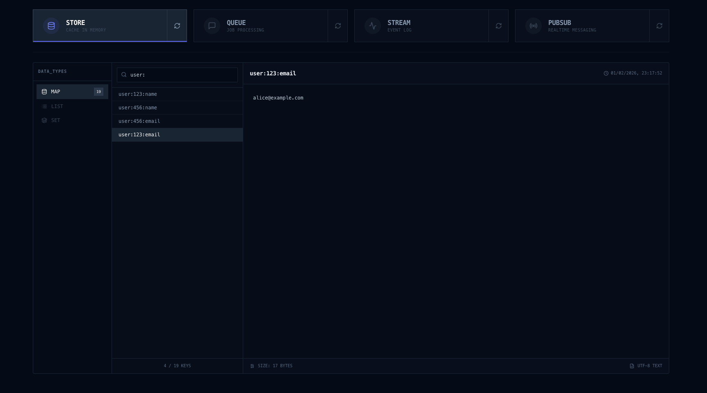

<div align="center">

# NEXO
### The High-Performance All-in-One Broker


One Binary. Four Brokers. Zero Operational Headaches.

### STORE • PUB/SUB • QUEUE • STREAM


</div>

---

## 📑 Table of Contents
- [The Mission](#the-mission)
- [Architecture](#architecture)
- [Brokers](#brokers)
  - [STORE (Shared State)](#1-store-shared-state)
  - [PUB/SUB (Real-Time Broadcast)](#2-pubsub-real-time-broadcast)
  - [QUEUE (Job Processing)](#3-queue-job-processing)
  - [STREAM (Event Log)](#4-stream-event-log)
- [Performance](#performance)
- [Dashboard](#dashboard)
- [Getting Started](#getting-started)

---

## The Mission

Modern backend architecture suffers from **Infrastructure Fatigue**. A typical stack requires juggling multiple specialized systems—Redis for caching, RabbitMQ for jobs, Kafka for streams—each with its own protocol, configuration, and maintenance overhead.

Nexo offers a **pragmatic trade-off**: it sacrifices "infinite horizontal scale" for **operational simplicity** and **vertical performance**.

Here's the reality: most scale-ups will **never** reach the scale where horizontal distribution becomes necessary. Their backends will bottleneck long before a single Rust-based broker does. Nexo is designed for that 99%—companies that need **high throughput without operational complexity**.
*   **Unified:** One TCP connection for Caching, Pub/Sub, Queues, and Streams.
*   **Simple:** Deploy a single binary. No clusters to manage. No JVMs to tune.
*   **Fast:** Built in Rust on top of Tokio for extreme throughput and incredible low latency.
*   **Dev Dashboard:** Built-in Web UI for local development. Inspect all brokers in real-time. (Auto-disabled in production)

## Architecture

Nexo runs as a **single binary** that exposes 4 distinct brokers and a built-in dashboard.

*   **Zero Dependencies:** No external databases, no JVM, no Erlang VM. Just one executable.
*   **Thread-Isolated:** Each broker runs on its own dedicated thread pool. Heavy processing on the *Queue* won't block *Pub/Sub* latency.
*   **Unified Interface:** A single TCP connection handles all protocols, reducing connection overhead.
*   **Embedded Observability:** The server hosts its own Web UI, giving you instant visibility into every broker's internal state without setting up external monitoring tools.


                                     ┌──────────────────────────────────────┐
                                     │              NEXO SERVER             │
                                     │                                      │       ┌──────────────┐
                                     │   ┌──────────────────────────────┐   │──────▶│              │
                                     │   │            STORE             │   │       │     RAM      │
                                     │   │        (Shared State)        │   │       │              │
              ┌─────────────┐        │   └──────────────────────────────┘   │       │  (Volatile)  │
              │             │        │                                      │       │              │
              │   Client    │───────▶│   ┌──────────────────────────────┐   │──────▶│              │
              │  (SDK/API)  │        │   │            PUBSUB            │   │       └──────────────┘
              │             │        │   │          (Realtime)          │   │
              └─────────────┘        │   └──────────────────────────────┘   │
                                     │                                      │
                                     │   ┌──────────────────────────────┐   │       ┌──────────────┐
                                     │   │            QUEUE             │   │──────▶│              │
                                     │   │        (Job Processing)      │   │       │     DISK     │
                                     │   └──────────────────────────────┘   │       │              │
                                     │                                      │       │   (Durable)  │
                                     │   ┌──────────────────────────────┐   │──────▶│              │
                                     │   │           STREAM             │   │       └──────────────┘
                                     │   │          (Event Log)         │   │
                                     │   └──────────────────────────────┘   │
                                     └───────────────┬──────────────────────┘
                                                     │
                                                     ▼
                                             ┌─────────────────┐
                                             │    Dashboard    │
                                             │     (Web UI)    │
                                             └─────────────────┘

## BROKERS

Nexo is built on the four pillars of modern event-driven architecture. Instead of managing four separate clusters, you get four specialized engines in one API.

Each broker is purpose-built to solve a specific architectural pattern:

*   **Store** replaces external caches (like Redis) for shared state.
*   **Pub/Sub** replaces message buses (like MQTT/Redis PubSub) for real-time volatility.
*   **Queue** replaces job queues (like RabbitMQ/SQS) for reliable background work.
*   **Stream** replaces event logs (like Kafka) for durable history.

Everything is available instantly via a unified Client.

### 1. STORE (Shared State)
**In-memory concurrent data structures.**

**Use Case:** Ideal for high-velocity data that needs to be instantly accessible across all your services, such as user sessions, API rate-limiting counters, and temporary caching.

```text
┌──────────────┐     SET(key, val)      ┌──────────────────┐
│   Client A   │───────────────────────▶│    NEXO STORE    │
└──────────────┘                        │   (Shared RAM)   │
┌──────────────┐      GET(key)          │    [Map<K,V>]    │
│   Client B   │◀───────────────────────│                  │
└──────────────┘                        └──────────────────┘
```

*   **Granular TTL:** Set expiration per-key or globally. Ideal for temporary API caches and rate-limiting counters.


### 2. PUB/SUB (Real-Time Broadcast)

**Transient message bus with Topic-based routing.**

**Use Case:** Designed for "fire-and-forget" scenarios where low latency is critical and message persistence is not required, such as live chat updates, stock tickers, or multi-service notifications.

```text
                                           ┌───────────────────────────┐
                                           │        NEXO PUBSUB        │
                                           │                           │──────▶ Sub 1 (Exact)
┌─────────────┐         PUBLISH            │  Topic: "home/kitchen/sw" │        "home/kitchen/sw"
│  Publisher  │───────────────────────────▶│                           │
└─────────────┘  msg: "home/kitchen/sw"    │  Topic: "home/+/sw"       │──────▶ Sub 2 (Wildcard +)
                                           │                           │        "matches single level"
                                           │  Topic: "home/#"          │
                                           │                           │──────▶ Sub 3 (Wildcard #)       
                                           └───────────────────────────┘        "matches everything under home"
```

*   **Fan-Out Routing:** Efficiently broadcasts a single incoming message to thousands of connected subscribers.
*   **Pattern Matching:**
    *   `+` **Single Level Wildcard:** Matches exactly one segment.
        *   *Example:* `sensors/+/temp` matches `sensors/kitchen/temp`.
    *   `#` **Multi Level Wildcard:** Matches all remaining segments to the end.
        *   *Example:* `logs/#` matches `logs/error`, `logs/app/backend`, etc.


### 3. QUEUE (Job Processing)

**Durable FIFO buffer with acknowledgments.**

**Use Case:** Essential for load leveling and ensuring reliable background processing. Use it to decouple heavy tasks (like video transcoding or email sending) from your user-facing API.

```text
┌──────────────┐        PUSH            ┌──────────────────┐
│   Producer   │───────────────────────▶│ 1. [ Job A ]     │
└──────────────┘                        │ 2. [ Job B ]     │───┐
                                        └────────▲─────────┘   │ POP
                                                 │             │
                                             ACK │             │
                                        ┌────────┴─────────┐   │
                                        │     Consumer     │◀──┘
                                        └──────────────────┘
```
*   **Smart Scheduling:** Supports **Delayed Jobs** (process in the future) and **Priority Queues** (urgent jobs first).
*   **Failure Recovery:** Automatically retries failed jobs and isolates permanent failures in **Dead Letter Queues (DLQ)**.
*   **Disk Persistence:** Safely persists all jobs to a Write-Ahead Log (WAL) to ensure data survival across restarts.

### 4. STREAM (Event Log)

**Append-only immutable log with offset tracking.**

**Use Case:** The source of truth for your system's history. Perfect for Event Sourcing, audit trails, and replaying historical data for analytics or debugging.

```text
┌──────────────┐       APPEND           ┌────────────────────────────────────┐
│   Producer   │───────────────────────▶│ 0:Event | 1:Event | 2:Event | ...  │
└──────────────┘                        └────────────────────────────────────┘
                                            ▲             ▲
                                     OFFSET │      OFFSET │
                                     ┌────────────┐   ┌────────────┐
                                     │ Consumer A │   │ Consumer B │
                                     └────────────┘   └────────────┘
```

*   **Immutable History:** Events are strictly appended and never modified, ensuring a tamper-proof audit log.
*   **Consumer Groups:** Maintains separate read cursors (offsets) for different consumers, allowing independent processing speeds.
*   **Replayability:** Consumers can rewind their offset to re-process historical events from any point in time.


##  Performance
*Benchmarks run on MacBook Pro M4 (Single Node).*

| Engine     | Throughput       | Latency (p99) | Workload / Config                       |
|:-----------|:-----------------|:--------------|:----------------------------------------|
| **STORE**  | **4.5M** ops/sec | < 1 µs        | `SET` operations (In-Memory)            |
| **PUBSUB** | **3.8M** msg/sec | < 1 µs        | `FANOUT`: 1 Publisher -> 1k Subscribers |
| **STREAM** | **650k** ops/sec | 1 µs          | `PUBLISH` (Persisted to Disk)           |
| **QUEUE**  | **160k** ops/sec | 3 µs          | `PUSH` (Persisted)                      |

##  Dashboard

Nexo comes with a built-in, zero-config dashboard exposed to local development.
Instantly verify if your microservices are communicating correctly by inspecting the actual contents of your Stores, Queues, and Streams in real-time.



## Getting Started

### 1. Run the Server

**Option A: Quick Start (Ephemeral)**
Run in-memory for quick testing. Data persists across restarts but is lost if the container is removed.
```bash
docker run -d -p 7654:7654 -p 8080:8080 nexobroker/nexo
```
This exposes:
- Port 7654 (TCP): Main server socket for SDK clients.
- Port 8080 (HTTP): Web Dashboard with status of all brokers.

**Option B: Production Mode (Persistent)**
Mount volumes to persist data. You can split Queues, Streams, and PubSub retained messages onto different disks.
```bash
docker run -d \
  --name nexo \
  -p 7654:7654 \                                     # Expose only TCP socket (Dashboard is OFF in prod)
  -v $(pwd)/nexo_queue:/storage/queue \              # Volume 1 (e.g. fast SSD)
  -v $(pwd)/nexo_stream:/storage/stream \            # Volume 2 (e.g. large HDD)
  -v $(pwd)/nexo_pubsub:/storage/pubsub \            # Volume 3 for PubSub retained messages
  -e QUEUE_ROOT_PERSISTENCE_PATH=/storage/queue \    # Map Queue persistency to Volume 1
  -e STREAM_ROOT_PERSISTENCE_PATH=/storage/stream \  # Map Stream persistency to Volume 2
  -e PUBSUB_ROOT_PERSISTENCE_PATH=/storage/pubsub \  # Map PubSub retained messages to Volume 3
  -e NEXO_ENV=prod \                                 # Set Production Mode (Dashboard OFF)
  nexobroker/nexo:latest
```

### 2. Install the SDK

```bash
npm install @emanuelepifani/nexo-client
```

### 3. Usage Example
Connect, execute operations, inspect data via the dashboard at `http://localhost:8080`.

```typescript
import { NexoClient } from '@emanuelepifani/nexo-client';
// Connect once
const client = await NexoClient.connect({ host: 'localhost', port: 7654 });


// --- 1. Store (Shared state Redis-like) ---
await client.store.map.set("user:1", { name: "Max", role: "admin" });
const user = await client.store.map.get<User>("user:1");
await client.store.map.del("user:1");


// --- 2. Pub/Sub (Realtime events MQTT-style + wildcards) ---
client.pubsub<Heartbeat>('edge/42/hb').publish({ ts: Date.now() });
await client.pubsub<Heartbeat>('edge/+/hb').subscribe(hb => console.log('edge alive:', hb.ts));
await client.pubsub<EdgeEvent>('edge/42/#').subscribe(ev => console.log('edge event:', ev.type));


// --- 3. Queue (Reliable background jobs) ---
const mailQ = await client.queue<MailJob>("emails").create();
await mailQ.push({ to: "test@test.com" });
await mailQ.subscribe((msg) => console.log(msg));


// --- 4. Stream (Durable history Event Log) ---
const stream = await client.stream<UserEvent>('user-events').create();
await stream.publish({ type: 'login', userId: 'u1' });
await stream.subscribe('analytics', (msg) => {console.log(`User ${msg.userId} performed ${msg.type}`); });


//Every broker support Binary format (zero JSON overhead)
const chunk = Buffer.alloc(1024 * 1024);
await client.store.map.set("blob", chunk);
client.pubsub<Buffer>('edge/42/video').publish(chunk);
client.stream<Buffer>('video-archive').publish(chunk);
client.queue<Buffer>('video-processing').push(chunk);
```

> **📚 Full Documentation:** For detailed API usage, configuration, and advanced patterns, visit the [**Node.js SDK Guide**](https://www.npmjs.com/package/@emanuelepifani/nexo-client).

---

<div align="center">

**Built for performance, designed for simplicity.**
<br />
Crafted with ❤️ by [Emanuel Epifani](https://github.com/emanuel-epifani).

</div>