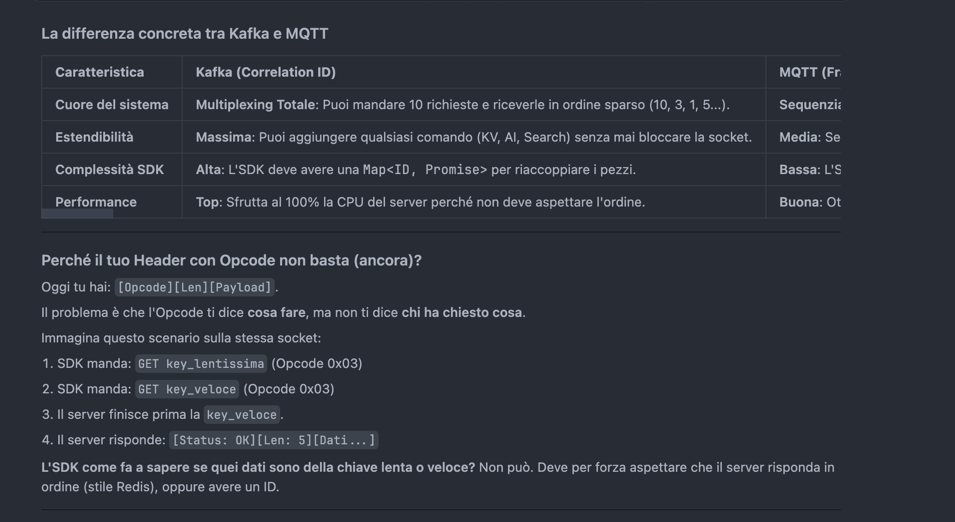
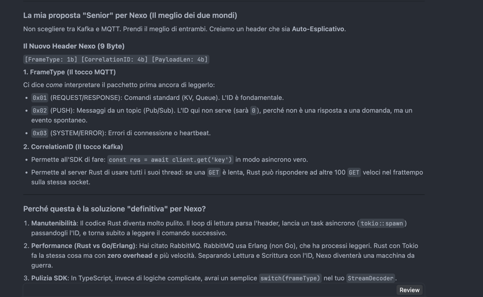
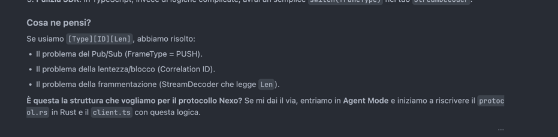

MQTT (Frame Type Oriented )
[Type: 1 byte] [Remaining Length: 1-4 byte] [Payload...]

KAFKA (Correlation ID Oriented):
[Size: 4 byte] [API Key: 2 byte] [ID: 4 byte] [Payload...]

HEADER DI NEXO:
[FrameType (1b)] [CorrelationID (4b)] [PayloadLen (4b)]

Cosa prendiamo da MQTT (Il FrameType):
    Usiamo il primo byte come un "semaforo" per l'SDK.
    Se l'SDK legge Type = 0x01 (RESPONSE), sa che deve cercare una Promise da risolvere.
    Se l'SDK legge Type = 0x02 (PUSH), sa che è un messaggio di un Topic (Pub/Sub) e lo manda agli eventi, senza nemmeno guardare l'ID.
    Vantaggio: Il codice dell'SDK è pulitissimo. Non deve "indovinare" se un pacchetto è una risposta o un messaggio spontaneo.

Cosa prendiamo da Kafka (Il CorrelationID):
    Usiamo l'ID per permettere al server Rust di essere veramente asincrono.
    Se fai una GET di una chiave enorme (lenta) e subito dopo una GET di una chiave piccola (veloce), il server Rust può risponderti prima sulla seconda.
    L'SDK guarda l'ID e dice: "Ah, questa è la risposta per la seconda richiesta, risolvo quella!".
    Vantaggio: Performance mostruose. Nessun comando blocca mai gli altri (No Head-of-Line Blocking).